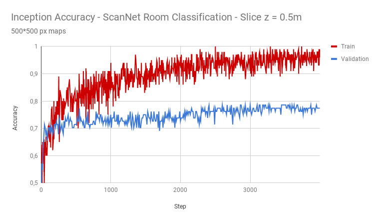

#room_classification_from_scratch_cnn
Project by [Paul Asquin](https://www.linkedin.com/in/paulasquin/) for Awabot - Summer 2018 paul.asquin@gmail.com  

# I.Introduction  
This repo is a part of the Room Classification Project. 
The aim of the Room Classification Project is to make an indoor mobile robot able to recognize a room using its 2D map. 
The output of the project should be "Kitchen", "Bedroom", "Batroom", etc.  

In order to achieve this goal, we have chosen to use Machine Learning techniques in order to obtain a powerfull recognition system with no hard-coded rules.  

As for every Machine Learning project, we need adapted datasets and a learning algorithm.  

Here is the overall architecture of the project :   
.  
├── room_classification_get_datasets  
├── room_classification_from_scratch_cnn  
├── room_classification_network_retrain  
├── Datasets (created by room_classification_get_datasets)  

Before comming to this repo, you should have installed the project datasets using _room\_classification\_get\_datasets_

# II. Goals and instructions
The goal of this repo is to use pretrained image recognition models, like inception_v3 or pnasnet, in order to build a new model for our project of room classification.   

At this step, you may have already installed the dependencies with _room\_classification\_get\_datasets_.  

# 1. Retrain a model

In order to retrain a model, you have to set wich model you want to use. For this, go into the file [dataset_retrain.py](dataset_retrain.py) and add in the _cmd_ string, the argument ' --tfhub_module 'urlToTheWantedModel'.
You can find such url in [this page](https://www.tensorflow.org/hub/modules/image) : click on the model you want and the given **Module URL**. Also, be sure that _\-\-image-dir_ is targeting your dataset.  
  
If you want to, you can change other parameters as --validation_percentage, --validation_batch_size... You will find the explaination of their influence in [this tutorial](https://www.tensorflow.org/hub/tutorials/image_retraining). 
Those parameters will be used during the call of [retrain.py](retrain.py), a script by Google. 
Still, during the developement, we also have added personnal argument to [retrain.py](retrain.py) for our personnal use.  
Here is a description of the arguments we added :  
\- suffix (String - Optional) ; Consider only particular suffix in file names.  
\- in_name (String - Optional) ; Consider only particular file names containing the str in_name in their name.  
\- augmentation (Bool - Optional, Default: False) ; Bool: If True, Augment the dataset, if False choose a random given transformation of a room slice.  
\- train_maximum (Bool - Optional, Default: False) ; If False, do nothing. If True, continue the program waiting for a CTRL+C, catched before making a clean exit.  
\- path_mislabeled_names (String - Optional) ; Path where to write a txt file containing names of mislabeled pictures.  

You'll have to indicate your parameters in the _cmd_ string of the [dataset_retrain.py](dataset_retrain.py) file. Once you are OK, you can run :  
```
sudo python3 dataset_retrain.py
```

# 2. Monitor a retraining
Tensorflow comes with Tensorboard, an awesome tool to monitor the the training performance.
To see the statistics, just run   
```
tensorboard --logdir /tmp/retrain_logs/
```
Then open your browser to the given url. It should be [127.0.0.1:6006](127.0.0.1:6006). You will be able to export those datas into csv file in order to make your own plot.

You'll be able to observe curves like : 

